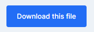
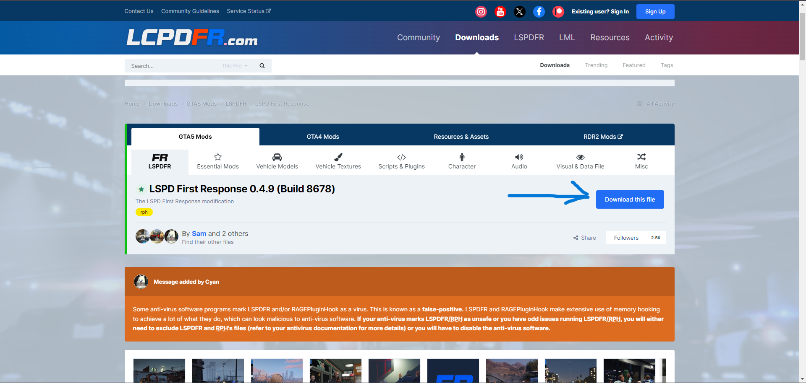
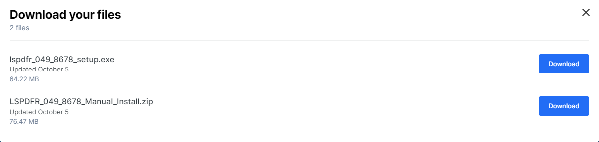

# Installation av LSPDFR

Tro det eller ej, det är väldigt enkelt att installera LSPDFR.

## Krav

För att komma igång behöver du följande:

- En `giltig` version av `Gta5`.
- En dator som klarar av att köra `Gta5`. Datorkraven hittar du [här](https://www.ign.com/wikis/gta-5/GTA_5_PC_Specs).

## Installation

1. Börja med att gå till [LSPD First Response nedladdningssida](https://www.lcpdfr.com/downloads/gta5mods/g17media/7792-lspd-first-response/).

2. Tryck på den blå installationsknappen.

   

   

3. En ruta med information om villkoren kommer att visas. Skrolla bara längst ner tills du ser en blå knapp med texten "Agree & Download". Klicka på den blåa knappen.

   
  
4. Nu har du 2 alternativ att välja i mellan. Men för att göra det lätt så tar du det översta <code>**"lspdfr_[Version nummer]_[Build nummer]_setup.exe"**</code>
  
  **Tänk på:** Om du väljer Manuell installaton så måste du lägga in filerna själv.
