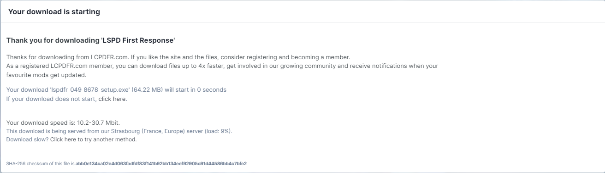

import Tabs from '@theme/Tabs';
import TabItem from '@theme/TabItem';

---
title: Installation av LSPDFR
---

# Installation av LSPDFR

Tro det eller ej, det är väldigt enkelt att installera LSPDFR.

## Krav

För att komma igång behöver du följande:

- En `giltig` version av `Gta5`.
- En dator som klarar av att köra `Gta5`. Datorkraven hittar du [här](https://www.ign.com/wikis/gta-5/GTA_5_PC_Specs).

## Installation

1. Börja med att gå till [LSPD First Response nedladdningssida](https://www.lcpdfr.com/downloads/gta5mods/g17media/7792-lspd-first-response/).

2. Tryck på den blå installationsknappen.

   

   

3. En ruta med information om villkoren kommer att visas. Skrolla bara längst ner tills du ser en blå knapp med texten "Agree & Download". Klicka på den blåa knappen.

   
  
4. Nu har du två alternativ att välja mellan. Men för att göra det enkelt väljer du det översta <code>**"lspdfr_[Version nummer]_[Build nummer]_setup.exe"**</code>
   
   **Tänk på:** Om du väljer manuell installation måste du lägga in filerna själv (rekommenderas ej).

5. Du kommer omdirigeras till en nedladdningssida. Beroende på internethastighet kan det ta olika lång tid.
   

   När installationen är klar dyker det upp i det högra hörnet.

   

   Klicka på filen som du nyss laddat ner.

6. Nu har själva installationen av LSPDFR påbörjats. Framför dig har du förmodligen (om du gjort rätt) en ruta liknande på bilden.
   

   Klicka på <code>ok</code> med "English" i tryggt i rutan.

---
 På nästa ruta trycker du <code>next</code>.

 

  På nästa ruta trycker du <code>I Agree</code>.

 

  På nästa ruta trycker du <code>Next</code>.

 

 ---
 Nu är det viktigt att du **INTE** trycker "Install" det första du gör.

 

 Du ska nu välja installationsmapp för <code>lspdfr</code>. Installationsmappen är din <code>gta5</code>-mapp så det är viktigt att du installerar <code>lspdfr</code> på rätt ställe.

 Nedan är det 3 olika alternativ för vart din <code>gta5</code> mapp befinner sig efter dom 3 platformarna Epic Games, Steam, Rockstar Launcher. Klicka på <code>Browse...</code> för att leta upp din <code>gta5</code>-mapp.

 Efter du valt klickar du "install".
 <Tabs>
  <TabItem value="epic" label="Epic Games" default>
    C:\Program Files\Epic Games\Gta V
  </TabItem>
  <TabItem value="steam" label="Steam">
    C:\Program Files (x86)\Steam\steamapps\common\Grand Theft Auto V
  </TabItem>
  <TabItem value="rockstar" label="Rockstar Launcher">
    C:\Program Files\Rockstar Games\Grand Theft Auto V
  </TabItem>
</Tabs>
--- 
 Tryck "Finish"

 

--- 

