import Tabs from '@theme/Tabs';
import TabItem from '@theme/TabItem';
import ReactPlayer from 'react-player'

# Installation av LSPDFR

Tro det eller ej, det är väldigt enkelt att installera LSPDFR.

## Krav

För att komma igång behöver du följande:

- En `giltig` version av `Gta5`.
- En dator som klarar av att köra `Gta5`. Datorkraven hittar du [här](https://www.ign.com/wikis/gta-5/GTA_5_PC_Specs).

## Installation

1. Börja med att gå till [LSPD First Response nedladdningssida](https://www.lcpdfr.com/downloads/gta5mods/g17media/7792-lspd-first-response/).

2. Tryck på den blå installationsknappen.

   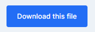

   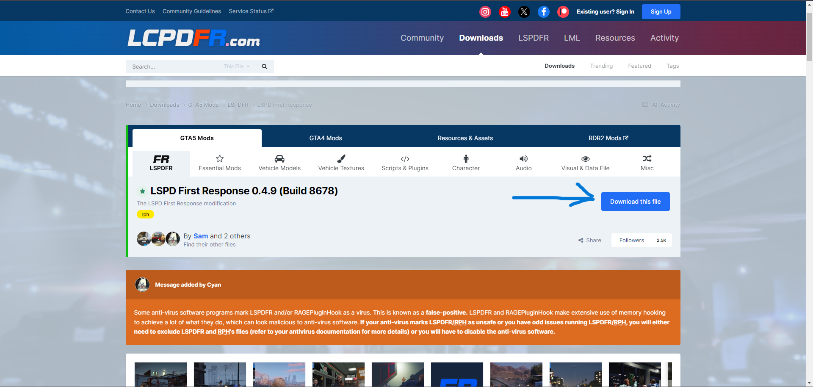

3. En ruta med information om villkoren kommer att visas. Skrolla bara längst ner tills du ser en blå knapp med texten "Agree & Download". Klicka på den blåa knappen.

   
  
4. Nu har du två alternativ att välja mellan. Men för att göra det enkelt väljer du det översta <code>**"lspdfr_[Version nummer]_[Build nummer]_setup.exe"**</code>
   
   **Tänk på:** Om du väljer manuell installation måste du lägga in filerna själv (rekommenderas ej).

5. Du kommer omdirigeras till en nedladdningssida. Beroende på internethastighet kan det ta olika lång tid.
   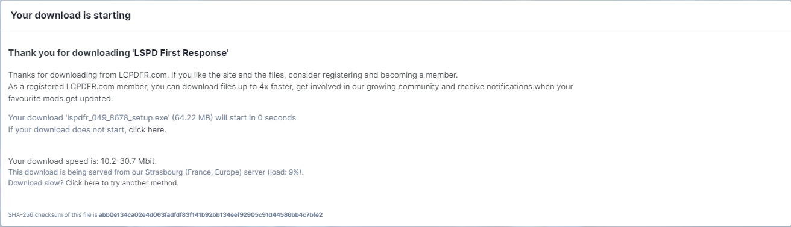

   När installationen är klar dyker det upp i det högra hörnet.

   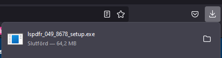

   Klicka på filen som du nyss laddat ner.

6. Nu har själva installationen av LSPDFR påbörjats. Framför dig har du förmodligen (om du gjort rätt) en ruta liknande på bilden.
   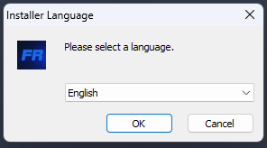

   Klicka på <code>ok</code> med "English" i tryggt i rutan.

---
 På nästa ruta trycker du <code>next</code>.

 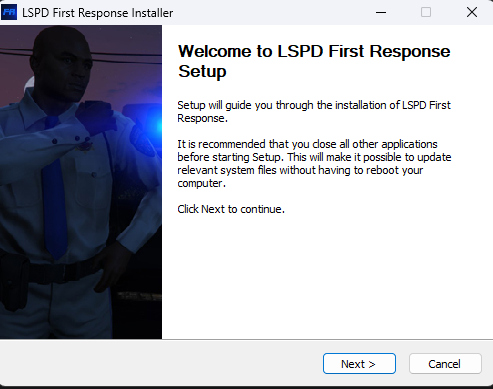

  På nästa ruta trycker du <code>I Agree</code>.

 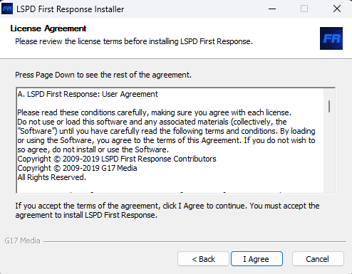

  På nästa ruta trycker du <code>Next</code>.

 

 ---
 Nu är det viktigt att du **INTE** trycker "Install" det första du gör.

 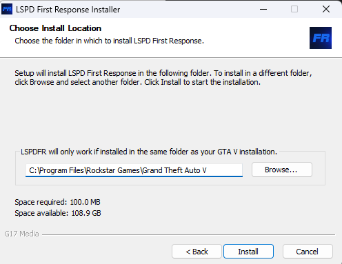

 Du ska nu välja installationsmapp för <code>lspdfr</code>. Installationsmappen är din <code>gta5</code>-mapp så det är viktigt att du installerar <code>lspdfr</code> på rätt ställe.

 Nedan är det 3 olika alternativ för vart din <code>gta5</code> mapp befinner sig efter dom 3 platformarna Epic Games, Steam, Rockstar Launcher. Klicka på <code>Browse...</code> för att leta upp din <code>gta5</code>-mapp.

<Tabs groupId="platform">
  <TabItem value="epic" label="Epic Games" default>
    C:\Program Files\Epic Games\Gta V
  </TabItem>
  <TabItem value="steam" label="Steam">
    C:\Program Files (x86)\Steam\steamapps\common\Grand Theft Auto V
  </TabItem>
  <TabItem value="rockstar" label="Rockstar Launcher">
    C:\Program Files\Rockstar Games\Grand Theft Auto V
  </TabItem>
</Tabs>
   Efter du valt klickar du "install".

--- 
 Tryck "Finish"

 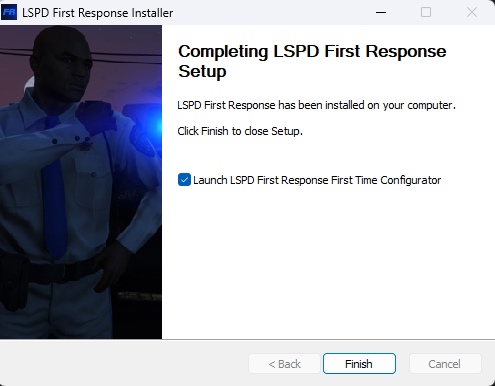

--- 
  Tryck "Next"
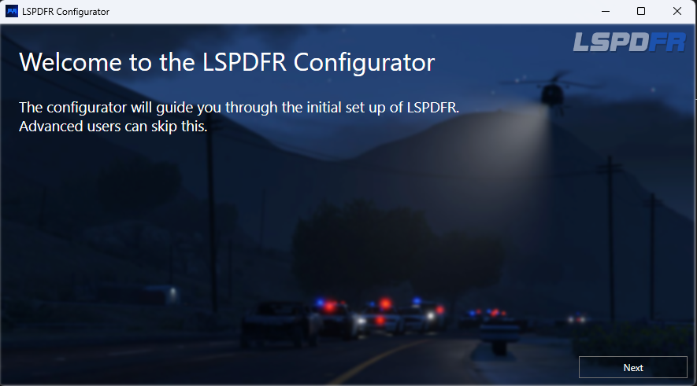

   Tryck "Show license"
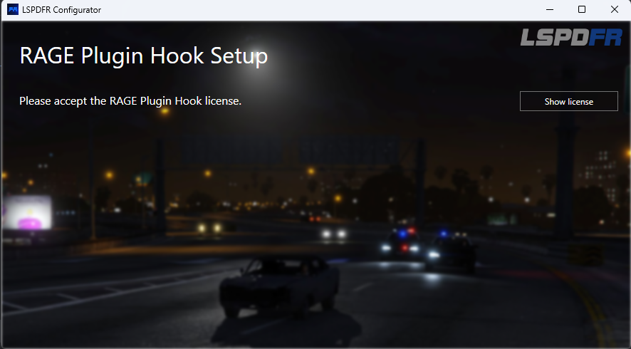

<code>Vänta</code> 5 sekunder och efter det trycker du "Accept"
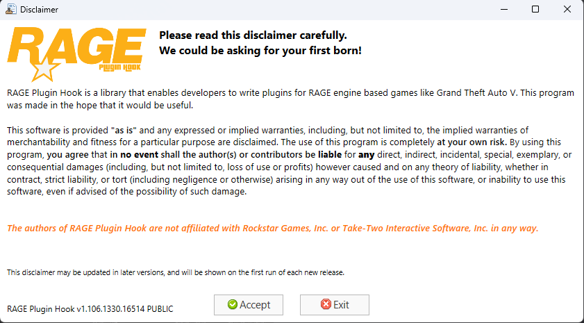 

   Tryck "Do it for me"
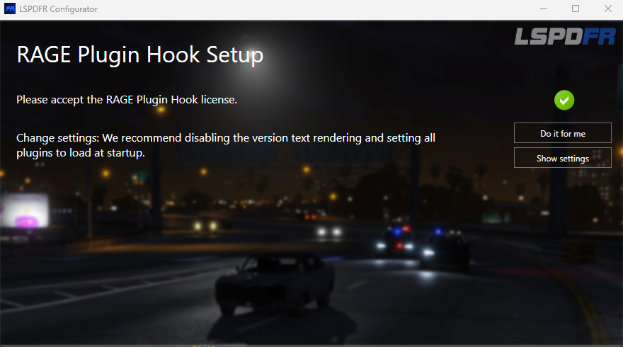

 Tryck "ok". Och så var lspdfr installerat.

 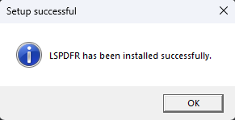

Tada! 🎂🎂🎂 

---
## Starta LSPDFR
   Nu när <code>lspdfr</code> är installerat är det dags att starta upp det.
   
   Beroende på vilket platfrom du spelar på är det olika hur du starta upp spelet.

<Tabs groupId="platform">
  <TabItem value="epic" label="Epic Games" default>
    Gå till filsökvägen där du installerat lspdfr (Din gta5 mapp)

    Leta upp filen "Ragepluginhook" 

    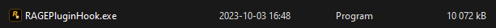
   
      Men vänta med att öpnna den tills du starta upp gta5 ifrån Epic Games.

      - Gå in på Epic Games.
      - Starta ditt gta5.
      - Tryck <code>Alt</code><code>+</code><code>Tab</code> för att ta dig ut ifrån spelet.
      - Gå tillbaks till gta5 mappen för att sedan klicka på ragepluginhook filen.

      Första gågen du startar upp ragepluginhook kommer en ruta upp. Tryck bara "Save And Close" Nere i höger hörn **UTAN** att röra nått annat i rutan.

      - Gå tillbak till gta5 som fortfarande är igång.

      Låt ditt ragepluginhook ladda klart. Sen är du inne i <code>lspdfr</code>. Ta dig till närmaste polisstation som du hittar på kartan för att gå i tjänst.

    Video om du trycker det är lättare(videon är på engelska).
    <ReactPlayer url='https://youtu.be/_Km7xMJthwA?t=226' />

   :::tip

   Dubbel klicka för att få stor bild

   Klicka på videon för att pausa
   :::
  </TabItem>
  <TabItem value="steam" label="Steam">
   Gå till filsökvägen där du installerat lspdfr (Din gta5 mapp)

    Leta upp filen "Ragepluginhook" 

    
   
      Men vänta med att öpnna den tills du starta upp gta5 ifrån Steam.

      - Gå in på Steam.
      - Starta ditt gta5.
      - Tryck <code>Alt</code><code>+</code><code>Tab</code> för att ta dig ut ifrån spelet.
      - Gå tillbaks till gta5 mappen för att sedan klicka på ragepluginhook filen.

      Första gågen du startar upp ragepluginhook kommer en ruta upp. Tryck bara "Save And Close" Nere i höger hörn **UTAN** att röra nått annat i rutan.

      - Gå tillbak till gta5 som fortfarande är igång.

      Låt ditt ragepluginhook ladda klart. Sen är du inne i <code>lspdfr</code>. Ta dig till närmaste polisstation som du hittar på kartan för att gå i tjänst.

   Video om du trycker det är lättare(videon är på engelska). Strunta att det står Epic Games Installation.
    <ReactPlayer url='https://youtu.be/_Km7xMJthwA?t=226' />

   :::tip

   Dubbel klicka för att få stor bild

   Klicka på videon för att pausa
   :::

  </TabItem>
  <TabItem value="rockstar" label="Rockstar Launcher">
    Gå till filsökvägen där du installerat lspdfr (Din gta5 mapp)

     Leta upp filen "Ragepluginhook" 

      

      Klicka på den. 

      Första gågen du startar upp ragepluginhook kommer en ruta upp. Tryck bara "Save And Close" Nere i höger hörn **UTAN** att röra nått annat i rutan.

      Låt gta5 starta upp. 

      Låt ditt ragepluginhook ladda klart. Sen är du inne i <code>lspdfr</code>. Ta dig till närmaste polisstation som du hittar på kartan för att gå i tjänst.

  </TabItem>
</Tabs>
